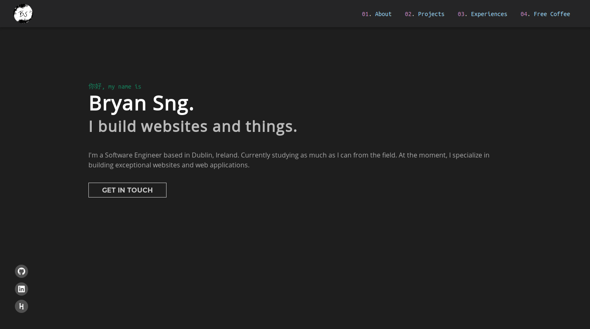

# bryansng.com

A personal website aimed to facilitate the function of a resume or CV, with ease of contact and further elaboration of work.

&nbsp;
## Characteristics
- Content of website is located in content.json. Editing is just as simple as editing the json file. ~~(could have used markdown to json, makes editin easier)~~
- Project's cards are based on GitHub's pinned repositories. Repo data is fetched using GraphQL. ~~(scales only if read-only OAuth tokens are allowed in public GitHub repos. which they don't. Can be fixed by fetching data from a backend server that hides the token)~~
- Theme design is based on [Visual Studio Code's Dark Plus](https://github.com/microsoft/vscode/tree/master/extensions/theme-defaults/themes).

<!-- &nbsp;
## Pages
### Homepage
 -->